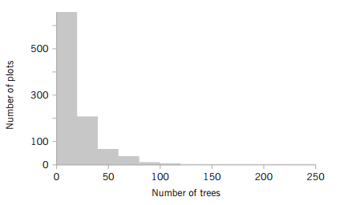

---
tags:
    - Stikprøvefordelinger
    - Sampling distributions
    - Den Centrale Grænseværdisætning (CLT)
    - Standardfejl (Standard Error)
    - Stikprøvegennemsnit
    - Stikprøvevarians
---
<h1 align="center">Fordelinger af stikprøvestørrelser (sampling distributions)</h1>

## Sessionsmateriale:

Ross: Kapitel 6

  <a href="Tutorial_6_notebook/">
    
     
    <strong>Se Tutorial 6: Fordelinger af stikprøvestørrelser</strong>
  </a>

<a href="Tutorial_6_notebook.ipynb" download>Download tutorial som notebook (.ipynb)</a>

[Se tutorial som markdown](Tutorial_6.md/)

[Recap og øvelser](https://drive.google.com/file/d/1WmQhsfPEkd-_-Gs8gI3QzfZ9_G5D0NDy/view?usp=sharing)

[Sessionnoter](https://drive.google.com/file/d/1YQHZe0Ukj0Jkhn3vTrjLkFKJfVwcWUOg/view?usp=sharing)

[Sessionsmateriale](https://viaucdk-my.sharepoint.com/:f:/g/personal/rib_viauc_dk/IgApE6KcPwR8SpOCRQ_VyjQbAdO5UUeC-Ju8A-OxEwBZlOA?e=cepbz7)

## Video Materiale:

**Sampling Distributions**

Playliste med 3 videoer, der dækker stikprøvefordelinger.

<iframe width="560" height="315" src="https://www.youtube.com/embed/videoseries?si=nfZqrLMzDC6S3oG0&amp;list=PLvxOuBpazmsP7UN00cNZX64N1o_8635ds" title="YouTube video player" frameborder="0" allow="accelerometer; autoplay; clipboard-write; encrypted-media; gyroscope; picture-in-picture; web-share" referrerpolicy="strict-origin-when-cross-origin" allowfullscreen></iframe>

---

## Sessionbeskrivelse

I denne session bevæger vi os fra at se på fordelinger af enkeltstående observationer til at undersøge egenskaberne ved stikprøver. Når vi indsamler data i praksis (for eksempel svartider for en server, mængden af fejl i en kodebase eller brugernes adfærd på en platform), beregner vi ofte stikprøvemål som gennemsnit eller varians for at drage konklusioner om hele populationen. Disse stikprøvemål (statistics) er i sig selv stokastiske variable og har derfor deres egne fordelinger – de såkaldte stikprøvefordelinger (sampling distributions).

Vi introducerer et af de absolut vigtigste resultater inden for sandsynlighedsregning og statistik: **Den Centrale Grænseværdisætning (Central Limit Theorem, CLT)**. Denne sætning fortæller os, at uanset hvordan den oprindelige population er fordelt, vil fordelingen af stikprøvegennemsnittet nærme sig en normalfordeling, når stikprøvestørrelsen bliver tilstrækkeligt stor. Dette gennembrud er fundamentet for meget af den statistiske inferens og hypotesetestning, vi skal arbejde med i resten af kurset. Vi ser desuden på begreber som standardfejl (standard error) som et mål for estimaters usikkerhed.

### Centrale begreber

- **Population vs. Stikprøve:** Parametre (f.eks. $\mu, \sigma^2$) over for stikprøve-statistikker (f.eks. $\bar{X}, S^2$)
- **Stikprøvefordelinger (Sampling distributions):** Fordelingen af en stikprøve-statistik
- **Stikprøvegennemsnittet ($\bar{X}$):** Forventningsværdi og varians for gennemsnittet
- **Standardfejl (Standard Error, SE):** Forskellen på standardafvigelse i data og standardfejl på gennemsnittet ($\sigma / \sqrt{n}$)
- **Den Centrale Grænseværdisætning (CLT):** Hvorfor og hvornår vi kan antage normalfordeling

!!! tip "Læringsmål"

    - Forstå forskellen mellem en populationsfordeling og en stikprøvefordeling.
    - Kunne anvende Den Centrale Grænseværdisætning (CLT) til at tilnærme fordelingen af et stikprøvegennemsnit.
    - Forstå begrebet standardfejl (standard error) og forklare, hvordan det adskiller sig fra almindelig standardafvigelse.
    - Kunne beregne sandsynligheder relateret til stikprøvegennemsnit ved brug af normalfordelingen.
    - Opnå en intuitiv forståelse for, hvordan stikprøvestørrelsen ($n$) påvirker usikkerheden og fordelingen af vores estimater.

## Øvelser

<!--
Indsæt bogreferencer og opgavelister her.
-->

Alle øvelser ligger i Del 1, udtagen 5 som ligger i Del 2.

#### Øvelse 1
Scientists at the Hopkins Memorial Forest in western Massachusetts have been collecting meteorological and environmental data in the forest data for more than 100 years. In the past few years, sulfate content in water samples from Birch Brook has averaged $7.48 \mathrm{mg} / \mathrm{L}$ with a standard deviation of $1.60 \mathrm{mg} / \mathrm{L}$.

1. What is the standard error of the sulfate in a collection of 10 water samples?

2. If 10 students measure the sulfate in their samples, what is the probability that their average sulfate will be between 6.49 and $8.47 \mathrm{mg} / \mathrm{L}$?

3. What do you need to assume for the probability calculated in (b) to be accurate?

??? answer "&nbsp;"
    1. 0.506
    2. 0.9496
    3. The samples must be independent and the population approximately normal.

#### Øvelse 2

Researchers in the Hopkins Forest (see Øvelse 1) also count the number of maple trees (genus acer) in plots throughout the forest. The following is a histogram of the number of live maples in 1002 plots sampled over the past 20 years. The average number of maples per plot was 19.86 trees with a standard deviation of 23.65 trees.

1. If we took the mean of a sample of eight plots, what would be the standard error of the mean?

2. Using the central limit theorem, what is the probability that the mean of the eight would be within 1 standard error of the mean?

3. Why might you think that the probability that you calculated in (b) might not be very accurate?

??? answer "&nbsp;"
    1. 8.3615
    2. 0.6827
    3. The data is strongly right-skewed and the sample size is too small to apply the central limit theorem.

#### Øvelse 3
A highway department has enough salt to handle a total of 80 inches of snowfall. Suppose the daily amount of snow has a mean of 1.5 inches and a standard deviation of .3 inch.

1. Approximate the probability that the salt on hand will suffice for the next 50 days.

2. What assumption did you make in solving part (a)? Do you think this assumption is justified? Explain briefly.

??? answer "&nbsp;"
    1. 0.9908
    2. The preceding assumes that the daily amounts of snow are independent, a dubious assumption.

#### Øvelse 4
An instructor knows from past experience that student exam scores have mean 77 and standard deviation 15. At present the instructor is teaching two separate classes — one of size 25 and the other of size 64.

1. Approximate the probability that the average test score in the class of size 25 lies between 72 and 82.
2. Repeat part (a) for a class of size 64.
3. What is the approximate probability that the average test score in the class of size 25 is higher than that of the class of size 64?
4. Suppose the average scores in the two classes are 76 and 83. Which class, the one of size 25 or the one of size 64, do you think was more likely to have averaged 83?

??? answer "&nbsp;"
    1. 0.9044
    2. 0.9924
    3. 0.5
    4. Class of size 25

#### Øvelse 5

**Solve this problem using Python.**

According to IDA’s salary statistics, the typical software engineer earns between DKK 45,781 and DKK 59,892 per month after five years of experience. The data is based on a sample of 378 software engineers with more than five years of experience.

Assume that salaries after five years are approximately normally distributed, and assume that the quoted “typical” interval corresponds approximately to one standard deviation around the mean, that is, $\mu \pm \sigma$.

The maximum recorded salary in the sample was DKK 67,476.

Based on this information:

1. Estimate the mean and standard deviation of the salary distribution.
2. What is the probability that a randomly selected software engineer earns more than DKK 55,000 per month?
3. If the 15 software engineers in your class are viewed as a random sample from this population, what is the probability that their average salary exceeds DKK 55,000 per month after five years of experience?
4. What is the probability that a randomly selected software engineer earns more than the maximum recorded salary of DKK 67,476 after five years of experience?
5. If the 15 software engineers in your class are viewed as a random sample from this population, what proportion of them would you expect to earn more than DKK 67,476 after five years of experience?

??? hint
    Start by extracting the parameters of the normal model.

    The “typical” interval is assumed to correspond to

    $$
    \mu - \sigma \quad \text{to} \quad \mu + \sigma .
    $$

    Therefore the mean is the midpoint of the interval, and the standard deviation is the distance from the mean to either endpoint.

    Once you have $\mu$ and $\sigma$, model the salary as

    $$
    X \sim N(\mu,\sigma).
    $$

    In Python you can compute probabilities directly using the normal distribution (for example with `scipy.stats.norm`). There is no need to convert to a standard normal variable manually.

    For the sample of 15 students, remember that the average salary follows the sampling distribution

    $$
    \bar X \sim N\!\left(\mu,\frac{\sigma}{\sqrt{n}}\right).
    $$

    The quantity $\sigma/\sqrt{n}$ is called the **standard error**.

    Finally, if $p$ is the probability that one engineer earns more than a certain amount, then the expected proportion of engineers in a sample with that property is also $p$, and the expected number in a sample of size $n$ is $np$.

??? answer "&nbsp;"
    1. 52836.6, 7055.5
    2. 0.3796
    3. 0.1175
    4. 0.0189
    5. 0.285 people

#### Øvelse 6

Suppose that \(X_1, X_2, X_3\) are independent random variables with the common probability mass function

\[
P(X_i = 0) = 0.2, \quad P(X_i = 1) = 0.3, \quad P(X_i = 3) = 0.5, \qquad i = 1,2,3
\]

1. Determine \(E\left[\bar{X}_2\right]\) and \(\operatorname{Var}\left(\bar{X}_2\right)\).

2. Determine \(E\left[\bar{X}_3\right]\) and \(\operatorname{Var}\left(\bar{X}_3\right)\).

??? hint
    First compute \(E[X_i]\) and \(\mathrm{Var}(X_i)\) from the given probability mass function.

    Then use the facts that expectation is linear and that the variance of a sum of independent random variables is the sum of their variances.

    Remember that

    \[
    X_2 = \frac{X_1 + X_2}{2}, \qquad
    X_3 = \frac{X_1 + X_2 + X_3}{3}.
    \]

    You may find it helpful to first compute \(E[X_i]\) and \(\mathrm{Var}(X_i)\), and then apply the formulas for \(E[aX+bY]\) and \(\mathrm{Var}(aX+bY)\).

??? answer "&nbsp;"
    \(E\left[\bar{X}_2\right]=E\left[\bar{X}_3\right]=1.8, \operatorname{Var}\left(\bar{X}_2\right)=.78, \operatorname{Var}\left(\bar{X}_3\right)=.52\)