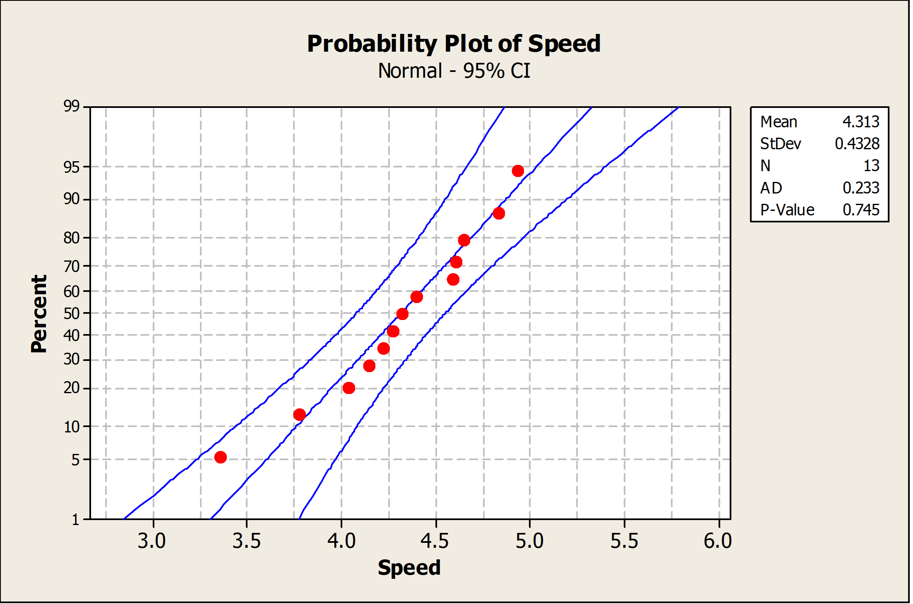

---
tags:
    - Intervalestimation
    - Konfidensintervaller
    - Konfidensniveau
    - Punktestimation
    - t-fordeling
    - Chi-i-anden-fordeling (χ²)
    - z-intervaller
    - Prædiktionsintervaller
    - To stikprøver (forskel mellem middelværdier)
---
<h1 align="center">Intervalestimation og konfidensintervaller</h1>

## Sessionsmateriale:

Ross: 7.1, 7.3, 7.4, 7.5.

[Recap og øvelser]()

[Sessionnoter]()

[Sessionsmateriale]()

---

## Sessionbeskrivelse

I denne session går vi fra **stikprøvefordelinger** (session 6) til at bruge dem til at sige noget kontrolleret om ukendte **populationsparametre**. Med udgangspunkt i Ross, kapitel 7 (*Parameter estimation*), afsnit **7.1**, **7.3**, **7.4** og **7.5**, skelner vi mellem **punktestimation** (ét tal som “bedste gæt”, fx stikprøvegennemsnit) og **intervalestimation**, hvor vi angiver et interval, der med en valgt sandsynlighed vil indeholde parameteren, når vi gentager forsøget under samme dataindsamling — det er idéen bag **konfidensintervaller** og det tilhørende **konfidensniveau** ($1-\alpha$).

I **7.3** arbejder vi med **konfidensintervaller for middelværdien** i normalmodellen: når populationsvariansen er kendt, bruges normalfordelingen (**z-baserede** intervaller); når den er ukendt, bruges typisk **t-fordelingen** med passende frihedsgrader. Vi ser også **prædiktionsintervaller** for en ny observation (ikke det samme som et CI for middelværdien). I **7.4** konstruerer vi intervaller for **forskellen mellem to normalpopulationsmiddelværdier** under de antagelser, bogen angiver. I **7.5** behandler vi **variansen** (og dermed standardafvigelsen) i en normalpopulation via intervaller knyttet til **$\chi^2$-fordelingen** for $(n-1)S^2/\sigma^2$. Afsnit om **maksimal likelihood** og **eksponentielle livstidsmodeller** springes over.

### Centrale begreber

- **Punktestimation vs. intervalestimation:** Estimat/statistik over for interval med konfidensniveau og gentagelsesfortolkning
- **Konfidensinterval og konfidensniveau ($1-\alpha$):** Hvad der er (og ikke er) sandsynligt for parameteren efter observerede data
- **CI for $\mu$ (normalmodel):** z-interval når $\sigma$ er kendt; t-interval når $\sigma$ estimeres med $S$
- **Prædiktionsinterval:** Usikkerhed for en *ny* observation frem for middelværdien
- **To stikprøver / differens:** Konfidensinterval for forskel mellem middelværdier under relevante antagelser
- **Varians i normalpopulation:** Intervaller baseret på $\chi^2$-fordelingen for $(n-1)S^2/\sigma^2$

!!! tip "Læringsmål"

    - Kunne forklare forskellen mellem punktestimation og intervalestimation og give en korrekt fortolkning af et konfidensniveau.
    - Kunne udlede og beregne konfidensintervaller for populationsmiddelværdien i normaltilfældet (kendt $\sigma$: z; ukendt $\sigma$: t).
    - Kunne vælge relevant fordeling (normal, t, $\chi^2$) ud fra model, antagelser og hvilken parameter der estimeres.
    - Kunne skelne mellem konfidensinterval for middelværdien og prædiktionsinterval for en enkelt fremtidig observation.
    - Kunne opstille og fortolke konfidensintervaller for forskellen mellem middelværdier i to normalpopulationer (som i pensum/antagelser for sessionen).
    - Kunne konstruere og fortolke konfidensintervaller for variansen (eller standardafvigelsen) i en normalpopulation.

## Øvelser

#### Øvelse 1
Scientists at the Hopkins Memorial Forest in western Massachusetts have been collecting meteorological and environmental data in the forest data for more than 100 years. In the past few years, sulfate content in water samples from Birch Brook has averaged \(7.48 \mathrm{mg} / \mathrm{L}\) with a standard deviation of \(1.60 \mathrm{mg} / \mathrm{L}\).

1. What is the standard error of the sulfate in a collection of 10 water samples?
2. If 10 students measure the sulfate in their samples, what is the probability that their average sulfate will be between 6.49 and \(8.47 \mathrm{mg} / \mathrm{L}\) ?
3. What do you need to assume for the probability calculated in (b) to be accurate?

??? answer "&nbsp;"
    1. \(SE = 0.51\)
    2. \(P(6.49 < \bar{X} < 8.47) = 0.95\)
    3. The samples are independent. And that the population is normally distributed, or the sample size is large.

#### Øvelse 2
Researchers in the Hopkins Forest (see Øvelse 1) also count the number of maple trees (genus acer) in plots throughout the forest. The following is a histogram of the number of live maples in 1002 plots sampled over the past 20 years. The average number of maples per plot was 19.86 trees with a standard deviation of 23.65 trees.

1. If we took the mean of a sample of eight plots, what would be the standard error of the mean?
2. Using the central limit theorem, what is the probability that the mean of the eight would be within 1 standard error of the mean?
3. Why might you think that the probability that you calculated in (b) might not be very accurate?

??? answer "&nbsp;"
    1. \(SE = 8.36\)
    2. \(0.68\)
    3. The central limit theorem applies when the sample size $n$ is large. Here $n = 8$ may be too small because the distribution of the counts of maple trees is quite skewed (as seen in the histogram above).

#### Øvelse 3
A manufacturer produces piston rings for an automobile engine. It is known that ring diameter is normally distributed with $\sigma=0.001$ millimeters. A random sample of 15 rings has a mean diameter of $\bar{x}=74.036$ millimeters.

1. Construct a $99 \%$ two-sided confidence interval on the mean piston ring diameter.
2. Construct a $99 \%$ lower-confidence bound on the mean piston ring diameter. Compare the lower bound of this confidence interval with the one in part (a).

??? answer "&nbsp;"
    1. $99 \%$ two-sided CI on the mean piston ring diameter. For $\alpha=0.01$, $z_{\alpha / 2}=z_{0.005}=2.58$, and $\bar{x}=74.036$, $\sigma=0.001$, $n=15$:

        $$
        \begin{gathered}
        \bar{x}-z_{0.005}\left(\frac{\sigma}{\sqrt{n}}\right) \leq \mu \leq \bar{x}+z_{0.005}\left(\frac{\sigma}{\sqrt{n}}\right) \\
        74.036-2.58\left(\frac{0.001}{\sqrt{15}}\right) \leq \mu \leq 74.036+2.58\left(\frac{0.001}{\sqrt{15}}\right) \\
        74.0353 \leq \mu \leq 74.0367
        \end{gathered}
        $$

    2. $99 \%$ one-sided lower bound on the mean piston ring diameter. For $\alpha=0.01$, $z_{\alpha}=z_{0.01}=2.33$ and $\bar{x}=74.036$, $\sigma=0.001$, $n=15$:

        $$
        \begin{aligned}
        \bar{x}-z_{0.01} \frac{\sigma}{\sqrt{n}} &\leq \mu \\
        74.036-2.33\left(\frac{0.001}{\sqrt{15}}\right) &\leq \mu \\
        74.0354 &\leq \mu
        \end{aligned}
        $$

        The one-sided lower bound is slightly larger than the lower endpoint of the two-sided interval, because $z_{0.01} < z_{0.005}$.

#### Øvelse 4
A civil engineer is analyzing the compressive strength of concrete. Compressive strength is normally distributed with $\sigma^2=1000(\mathrm{psi})^2$. A random sample of 12 specimens has a mean compressive strength of $\bar{x}=3250$ psi.

1. Construct a $95 \%$ two-sided confidence interval on mean compressive strength.
2. Construct a $99 \%$ two-sided confidence interval on mean compressive strength. Compare the width of this confidence interval with the width of the one found in part (a).

??? answer "&nbsp;"
    1. $95 \%$ two-sided CI on the mean compressive strength. With $z_{\alpha/2}=z_{0.025}=1.96$, $\bar{x}=3250$, $\sigma=\sqrt{1000}\approx 31.62$, $n=12$:

        $$
        \begin{aligned}
        3250-1.96\left(\frac{31.62}{\sqrt{12}}\right) &\leq \mu \leq 3250+1.96\left(\frac{31.62}{\sqrt{12}}\right) \\
        3232.11 &\leq \mu \leq 3267.89
        \end{aligned}
        $$

    2. $99 \%$ two-sided CI: $z_{0.005}=2.58$.

        $$
        3250-2.58\left(\frac{31.62}{\sqrt{12}}\right) \leq \mu \leq 3250+2.58\left(\frac{31.62}{\sqrt{12}}\right)
        $$

        i.e. approximately $3226.48 \leq \mu \leq 3273.52$. The $99 \%$ interval is wider than the $95 \%$ interval, because a higher confidence level requires a larger critical value.

#### Øvelse 5
An article in Computers & Electrical Engineering ["Parallel Simulation of Cellular Neural Networks" (1996, Vol. 22, pp. 61-84)] considered the speedup of cellular neural networks (CNNs) for a parallel general-purpose computing architecture based on six transputers in different areas. The data follow:

| 3.775302 | 3.350679 | 4.217981 | 4.030324 | 4.639692 |
| :--- | :--- | :--- | :--- | :--- |
| 4.139665 | 4.395575 | 4.824257 | 4.268119 | 4.584193 |
| 4.930027 | 4.315973 | 4.600101 |  |  |

1. Is there evidence to support the assumption that speedup of CNN is normally distributed? Include a graphical display in your answer.
2. Construct a $95 \%$ two-sided confidence interval on the mean speedup.
3. Construct a $95 \%$ lower confidence bound on the mean speedup.

??? answer "&nbsp;"
    1. The data appear to be normally distributed based on examination of the normal probability plot below.

        

            
        

    2. $95 \%$ confidence interval on mean speed-up:

        $$
        \begin{aligned}
        & n=13 \quad \bar{x}=4.313 \quad s=0.4328 \quad t_{0.025,12}=2.179 \\
        & \bar{x}-t_{0.025,12}\left(\frac{s}{\sqrt{n}}\right) \leq \mu \leq \bar{x}+t_{0.025,12}\left(\frac{s}{\sqrt{n}}\right) \\
        & 4.051 \leq \mu \leq 4.575
        \end{aligned}
        $$

    3. $95 \%$ lower confidence bound on mean speed-up:

        $$
        \begin{aligned}
        & n=13 \quad \bar{x}=4.313 \quad s=0.4328 \quad t_{0.05,12}=1.782 \\
        & \bar{x}-t_{0.05,12}\left(\frac{s}{\sqrt{n}}\right) \leq \mu \\
        & 4.099 \leq \mu
        \end{aligned}
        $$

#### Øvelse 6
An article in Technometrics ["Two-Way Random Effects Analyses and Gauge R\&R Studies" (1999, Vol. 41(3), pp. 202-211)] studied the capability of a gauge by measuring the weight of paper. The data for repeated measurements of one sheet of paper are in the following table. Construct a $95 \%$ one-sided upper confidence interval for the standard deviation of these measurements. Check the assumption of normality of the data and comment on the assumptions for the confidence interval.

| Observations |  |  |  |  |
| :--- | :--- | :--- | :--- | :--- |
| 3.481 | 3.448 | 3.485 | 3.475 | 3.472 |
| 3.477 | 3.472 | 3.464 | 3.472 | 3.470 |
| 3.470 | 3.470 | 3.477 | 3.473 | 3.474 |

??? answer "&nbsp;"
    $95 \%$ one-sided upper confidence bound for $\sigma$ (from $\chi^2$ for $\sigma^2$):

    $$
    \begin{aligned}
    n=15, \quad s&=0.00831 \\
    \chi_{1-\alpha, n-1}^2 &=\chi_{0.95,14}^2=6.53 \\
    \sigma^2 &\leq \frac{(n-1)s^2}{\chi_{0.95,14}^2}=\frac{14(0.00831)^2}{6.53} \\
    \sigma &\leq 0.0122
    \end{aligned}
    $$

    The data do not appear to be normally distributed based on an examination of the normal probability plot in the textbook solution; in that case the $\chi^2$-interval for $\sigma$ is not strictly valid.

#### Øvelse 7
The 2004 presidential election exit polls from the critical state of Ohio provided the following results. The exit polls had 2020 respondents, 768 of whom were college graduates. Of the college graduates, 412 voted for George Bush.

1. Calculate a $95 \%$ confidence interval for the proportion of college graduates in Ohio who voted for George Bush.
2. Calculate a $95 \%$ lower confidence bound for the proportion of college graduates in Ohio who voted for George Bush.

??? answer "&nbsp;"
    1. $95 \%$ confidence interval for the proportion of college graduates in Ohio that voted for George Bush:

        $$
        \begin{gathered}
        \hat{p}=\frac{412}{768}=0.536, \quad n=768, \quad z_{\alpha / 2}=1.96 \\
        \hat{p}-z_{\alpha / 2} \sqrt{\frac{\hat{p}(1-\hat{p})}{n}} \leq p \leq \hat{p}+z_{\alpha / 2} \sqrt{\frac{\hat{p}(1-\hat{p})}{n}} \\
        0.501 \leq p \leq 0.571
        \end{gathered}
        $$

    2. $95 \%$ lower confidence bound:

        $$
        \begin{aligned}
        \hat{p}-z_\alpha \sqrt{\frac{\hat{p}(1-\hat{p})}{n}} & \leq p \\
        0.506 & \leq p
        \end{aligned}
        $$
