---
tags:
    - Simpel lineær regression
    - Mindste kvadraters metode
    - Residualer
    - Korrelation
    - Bestemmelseskoefficient
    - OLS
    - Konfidensinterval (regression)
---
<h1 align="center">Simpel lineær regression</h1>

## Sessionsmateriale:

Ross: 9.1–9.6

  <a href="Tutorial_9_notebook/">
    
     
    <strong>Se Tutorial 9: Simpel lineær regression</strong>
  </a>

<a href="Tutorial_9_notebook.ipynb" download>Download tutorial som notebook (.ipynb)</a>

[Se tutorial som markdown](Tutorial_9.md/)

**Formler og metrics (engelsk, detaljeret):** [Calculating_metrics.md](Calculating_metrics.md)

[Recap og øvelser]()

[Sessionnoter]()

[Sessionsmateriale]()

## Video Materiale:

Der er én playliste med 12 videoer. Videoerne gennemgår de grundlæggende begreber og metoder for regression.

**Simple Linear Regression**

<iframe width="560" height="315" src="https://www.youtube.com/embed/videoseries?si=oMz8DfBGWlDNUsv7&amp;list=PLvxOuBpazmsND0vmkP1ECjTloiVz-pXla" title="YouTube video player" frameborder="0" allow="accelerometer; autoplay; clipboard-write; encrypted-media; gyroscope; picture-in-picture; web-share" referrerpolicy="strict-origin-when-cross-origin" allowfullscreen></iframe>

---

## Sessionbeskrivelse

I denne session arbejder vi med simpel lineær regression (Ross kap. 9): et respons $Y$ modelleres som en lineær funktion af én forklarende variabel $x$. Vi estimerer $\beta_0$ og $\beta_1$ med mindste kvadraters metode, ser på fordelinger af estimatorer, $t$-tests og konfidensintervaller for koefficienterne, $R^2$ og Pearson $r$, og vurderer modellen med residual- og QQ-plots.

Øvelserne er alene opgaver i simpel lineær regression (MK-estimation, modeltilpasning, inferens, $r$/$R^2$, residualer og forudsigelse) hentet fra tidligere eksamen.

* Python-gennemgang: Tutorial 9 (statsmodels og scikit-learn: `pip install …` eller celle 0 i notebook med `%pip`, hvis import fejler)
* Formler og metrics: [Calculating_metrics.md](Calculating_metrics.md).

### Centrale begreber

- Den simple lineære model $Y = \beta_0 + \beta_1 x + \varepsilon$ og MK-estimaterne $\hat{\beta}_0$, $\hat{\beta}_1$
- Fittede værdier og residualer; SSE, MSE og skøn over $\sigma^2$
- Standardfejl og $t$-fordeling med $n-2$ frihedsgrader til inferens om $\beta_1$ og $\beta_0$
- Konfidensintervaller og tests for $H_0$: $\beta_1 = 0$
- $R^2$ og Pearson $r$ — fortolkning og sammenhæng i simpel regression
- Residualanalyse (linearitet, varians, normalitet)

!!! tip "Læringsmål"

    - Kunne opskrive den simple lineære regressionsmodel og beregne mindste kvadraters estimater (inkl. formler med summationer som i lærebogen).
    - Kunne fortolke fittede værdier, residualer, SSE og MSE.
    - Kunne gennemføre og fortolke inferens om $\beta_1$ (og skitse $\beta_0$): $t$-test og konfidensintervaller.
    - Kunne beregne og fortolke $R^2$ og $r$, og relatere dem til modelvariation (SSR, SSE, SST).
    - Kunne vurdere modelantagelser vha. residualplots og QQ-plots og relatere til Ross 9.6.

## Øvelser

<!--
Kun regression. Figurer i svar: src/ (ex6_*, ex8_*, ex11_* m.fl.).
-->

#### Øvelse 1 (Tidligere eksamensopgave)

A professor in the School of Engineering in a university polled a dozen colleagues about the number of professional meetings they attended in the past five years $(x)$ and the number of papers they submitted to refereed journals $(y)$ during the same period. The summary data are given as follows:

$$
\begin{aligned}
n & =12, \quad \bar{x}=4, \quad \bar{y}=12 \\
\sum_{i=1}^n x_i^2 & =232, \quad \sum_{i=1}^n x_i y_i=318
\end{aligned}
$$

Fit a simple linear regression model between $x$ and $y$ by finding out the estimates of intercept and slope. Hint: Use the Least Squares Estimates formula from the book.

??? answer "&nbsp;"
    \begin{aligned}
    &\text { From the data summary we get }\\
    &\begin{aligned}
    & \hat{B}_1=\frac{(12)(318)-[(4)(12)][(12)(12)]}{(12)(232)-[(4)(12)]^2}=-6.45 \\
    & \hat{B}_0=12-(-6.45)(4)=37.8
    \end{aligned}
    \end{aligned}

#### Øvelse 2 (Tidligere eksamensopgave)

Data collected in 1960 from the National Cancer Institute provides the per capita numbers of cigarettes sold along with death rates for various forms of cancer (see [Smoking and Cancer.xlsx](SmokingandCancer.xlsx)).

1. Build regression models with cigarettes sold as the independent variable and each of the four cancer types as the dependent variable. Accompany each model with a scatterplot and a trend line as well as confidence intervals for the regression parameters.
2. For each model, inspect the residuals to confirm that the assumptions about normality and non-patterns are met.
3. Which of the four cancer types exhibit the best correlation with cigarettes sold? Assess using the correlation coefficient.
4. In which data pairs is cigarettes sold a good predictor for the type of cancer? Assess using the correlation of determination and interpret the meaning of this number.
5. For the model that has the best correlation, find the predicted value of deaths per 100 k for 40 and 50 cigarettes sold per capita. Feel free to include $95 \%$ prediction intervals to your predictions.

??? answer "&nbsp;"
    1. 
    
        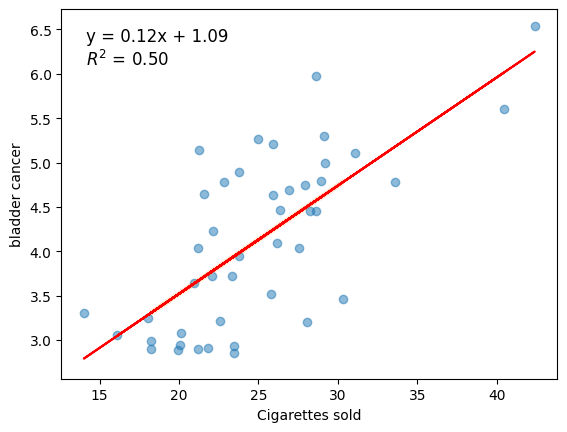
        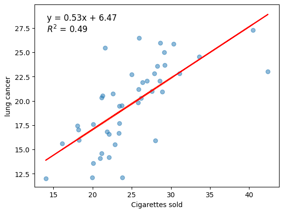  
        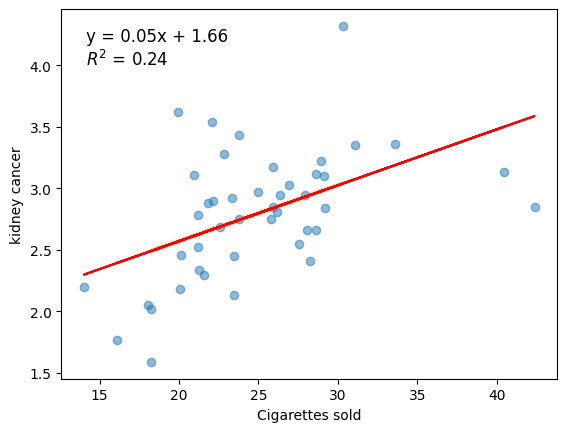
        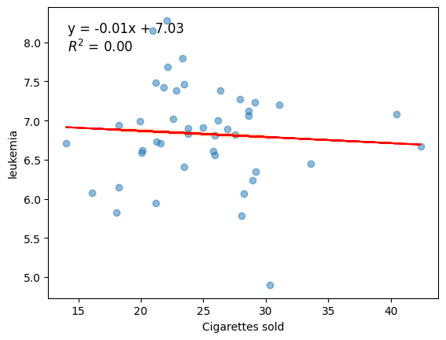  

    2. 

        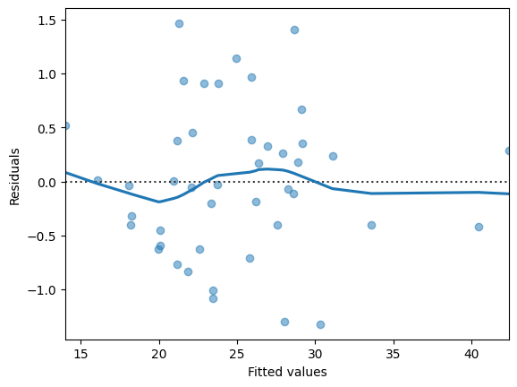
        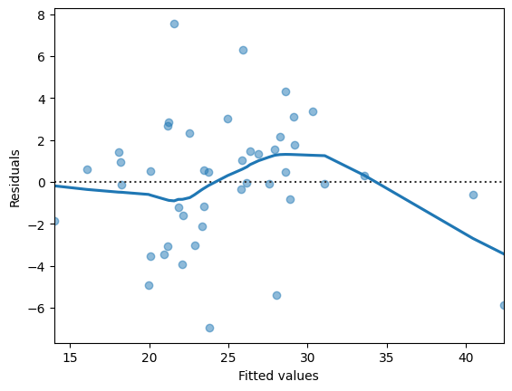  
        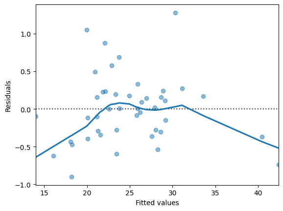
        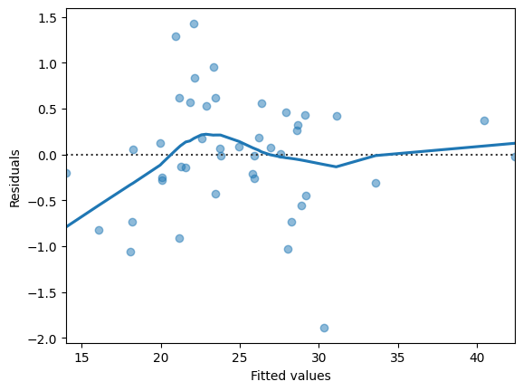  

    3. 

        Correlation coefficient for bladder cancer model: 0.703621859461442

    4. 
    
        Correlation coefficient for bladder cancer model: 0.703621859461442

        R-squared for bladder cancer model: 0.4950837211119772

    5. 

        Bladder cancer rate for cigarette sales of 40: 5.96

        Bladder cancer rate for cigarette sales of 50: 7.18

#### Øvelse 3 (Tidligere eksamensopgave)

The data in [Salary.xlsx](Salary.xlsx) show the (monthly) salary along with years of experience of 31 software developers.

1. Create a complete regression analysis of the data mentioned above. Your analysis must include a plot of the data, considerations about outliers, estimates for the regression parameters and confidence intervals for these, considerations about the assumptions of the model, as well as an assessment of the adequacy of the model.
2. According to the model, what salary can a newly graduated software developer with no experience expect?
3. Assuming the developer starts his/her career at 27 and retires when he/she is 67 , what will be the salary of the developer when he/she retires? Does this sound plausible?

??? answer "&nbsp;"
    1.         

        | OLS Regression Results |  |  |  |  |  |  |
        | :---: | :---: | :---: | :---: | :---: | :---: | :---: |
        | Dep. Variable: |  | Salary | R-sq | uared: | 0.936 |  |
        | Model: |  | OLS | Adj. R-sq | uared: | 0.934 |  |
        | Method: | Least | Squares | F-st | atistic: | 412.4 |  |
        | Date: | Mon, 01 F | eb 2021 Pr | Prob (F-sta | tistic): | $2.72 \mathrm{e}-18$ |  |
        | Time: |  | 14:20:57 L | Log-Likel | ihood: | -296.40 |  |
        | No. Observations: |  | 30 |  | AIC: | 596.8 |  |
        | Df Residuals: |  | 28 |  | BIC: | 599.6 |  |
        | Df Model: |  | 1 |  |  |  |  |
        | Covariance Type: | : nonrobust |  |  |  |  |  |
        |  | coef | std err | t | $\mathrm{P}>\|\mathrm{t}\|$ | [0.025 | 0.975] |
        | const | $2.162 e+04$ | 1921.463 | 11.254 | 0.000 | $1.77 \mathrm{e}+04$ | $2.56 \mathrm{e}+04$ |
        | YearsExperience | 6501.7589 | 320.170 | 20.307 | 0.000 | 5845.921 | 7157.597 |
        | Omnibus: | 4.321 Du | bin-Watson: | n: 1.751 |  |  |  |
        | Prob(Omnibus): | 0.115 Jarq | ue-Bera (JB): | ): 2.044 |  |  |  |
        | Skew: | 0.330 | Prob(JB): | ): 0.360 |  |  |  |
        | Kurtosis: | 1.905 | Cond. No. | o. 13.2 |  |  |  |

        Wrnings:

        [1] Standard Errors assume that the covariance matrix of the errors is correctly specified.

        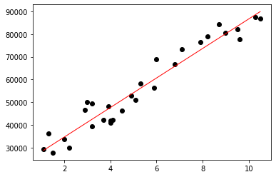

        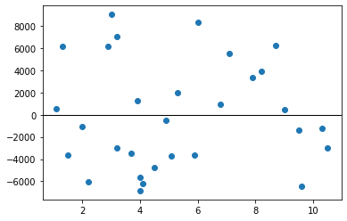

        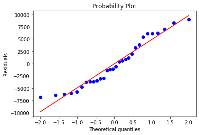        

        Skewness = 0.3305

        Kurtosis = -1.0946

        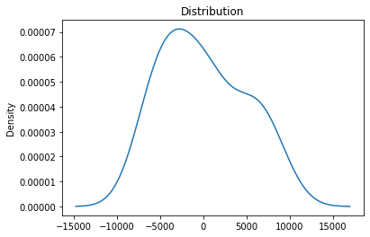

    2. 
    
        A newly employed developer can expect a monthly wage of kr. 21623.65

    3. 

        If a software developer retires after 40 years, he or she will have a wage of kr. 281694.01

        (This sounds very unlikely!)

#### Øvelse 4 (Tidligere eksamensopgave)

As part of their final project, two ICT students are working on a data warehouse support system. The major workload is the warehouse orders. Thus, the key business metric is identified as number of order lines. The students want to find a method to predict CPU utilization based on the number of order lines entered into the system and have collected 31 samples. The data are in [CPU_order_lines.xlsx](CPU_order_lines.xlsx) (columns: `Sample`, `CPU_utilisation`, `Order_lines_per_day`).

1. Create a complete regression analysis of the data in the spreadsheet. Your analysis must include a plot of the data, considerations about outliers, estimates for the regression parameters and confidence intervals for these, considerations about the assumptions of the model, as well as an assessment of the adequacy of the model.

??? answer "&nbsp;"

    1. 

        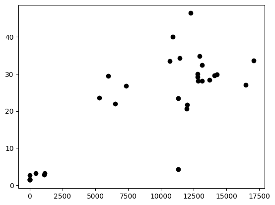

        | OLS Regression Results |  |  |  |  |  |  |
        | :---: | :---: | :---: | :---: | :---: | :---: | :---: |
        | Dep. Variable: |  | Unnan | med: 1 |  | R-squared: | 0.669 |
        | Model: |  |  | OLS | Adj. | squared: | 0.658 |
        | Method: |  | Least Sq | quares |  | F-statistic: | 58.63 |
        | Date: | e: Tue, 27 Nov 2018 |  |  | Prob (F-statistic): |  | 1.92e-08 |
        | Time: |  | 14:45:20 |  | Log-Likelihood: |  | -107.14 |
        | No. Observations: |  | 31 |  | AIC: |  | 218.3 |
        | Df Residuals: |  | 29 |  | BIC: |  | 221.1 |
        | Df Model: |  | 1 |  |  |  |  |
        | Covariance Type | e: nonrobust |  |  |  |  | 0.975] |
        |  | coef | std err | t | $\mathrm{P}>\|\mathrm{t}\|$ | [0.025 |  |
        | const 4. | 6291 | 2.652 | 1.745 | 0.092 | -0.796 | 10.054 |
        | Unnamed: 20. | . 0019 | 0.000 | 7.657 | 0.000 | 0.001 | 0.002 |
        | Omnibus: | 3.065 | Durbin-Watson: |  |  | 1.919 |  |
        | Prob(Omnibus): | 0.216 | Jarque-Bera (JB): |  |  | 2.010 |  |
        | Skew: | 0.000 | Prob(JB): |  |  | $0.366$ |  |
        | Kurtosis: | 4.248 | Cond. No. $\quad 1.95 \mathrm{e}+04$ |  |  |  |  |

        Warnings:

        [1] Standard Errors assume that the covariance matrix of the errors is correctly specified.

        [2] The condition number is large, 1.95e+04. This might indicate that there are
        strong multicollinearity or other numerical problems.

        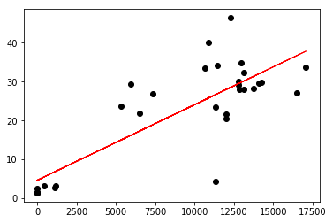
        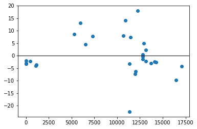
        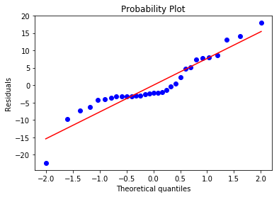

        Skewness = 0.0004

        Kurtosis = 1.2476

        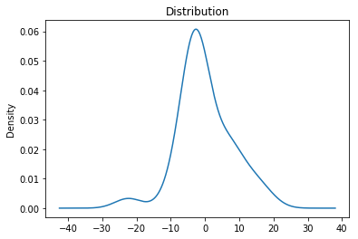
